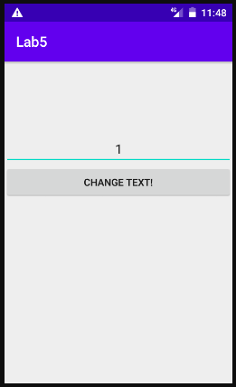
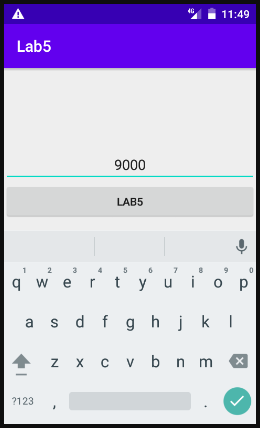
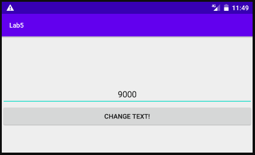
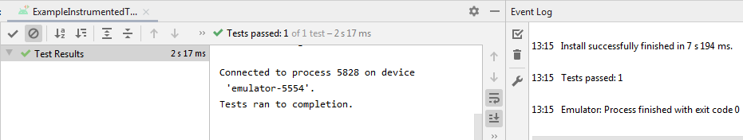
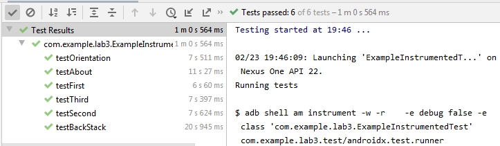

# Лабораторная работа №5. UI Tests.
## Цели:
* Ознакомиться с принципами и получить практические навыки разработки UI тестов для Android приложений.

## Задачи:
### Задача 1. Простейший UI тест.
От меня требуется разработать простое приложение с кнопкой и текстовым полем и ознакомится с возможностями тестирования Espresso Framework на его примере.

Ниже привожу листинги MainActivity.kt и activity_main.xml соответственно, без комментариев ввиду тривиальности написанной программы:
```
class MainActivity : AppCompatActivity() {
    override fun onCreate(savedInstanceState: Bundle?) {
        super.onCreate(savedInstanceState)

        val binding = ActivityMainBinding.inflate(layoutInflater)
        binding.button.setOnClickListener() {
            binding.button.text = getString(R.string.app_name)
        }
        setContentView(binding.root)
    }
}
```

```
<?xml version="1.0" encoding="utf-8"?>
<LinearLayout xmlns:android="http://schemas.android.com/apk/res/android"
    xmlns:app="http://schemas.android.com/apk/res-auto"
    xmlns:tools="http://schemas.android.com/tools"
    android:id="@+id/ConstraintLayout"
    android:orientation="vertical"
    android:layout_width="match_parent"
    android:layout_height="match_parent"
    tools:context=".MainActivity">

    <Space
        android:layout_width="match_parent"
        android:layout_height="100dp" />

    <EditText
        android:id="@+id/editText"
        android:layout_width="match_parent"
        android:layout_height="wrap_content"
        android:ems="10"
        android:gravity="center"
        android:inputType="textPersonName"
        android:text="1"
        android:importantForAutofill="no" />

    <Button
        android:id="@+id/button"
        android:layout_width="match_parent"
        android:layout_height="wrap_content"
        android:text="Change text!" />

</LinearLayout>
```

Ниже привожу скриншоты ручного тестирования в хронологическом порядке. Они показывают, что при повороте экрана содержимое текстового поля действительно сохраняется, а надпись на кнопке сбрасывается в исходное состояние.

Изначальное состояние:



После нажатия на кнопку и введения нового текста:



После поворота экрана:



От меня требуется написать тест, делающий ту же работу автоматически.

Приведу листинг написанного теста ExampleInstrumentedTest.kt:
```
@RunWith(AndroidJUnit4::class)
class ExampleInstrumentedTest {

    @get:Rule
    val activityTestRule = ActivityScenarioRule(MainActivity::class.java)

    @Test
    fun testButton() {
        val bView = onView(withId(R.id.button))
        val tView = onView(withId(R.id.editText))

        bView.check(ViewAssertions.matches(withText("Change text!")))
        tView.check(ViewAssertions.matches(withText("1")))
        bView.perform(click())
        tView.perform(replaceText("42"))
        bView.check(ViewAssertions.matches(withText("Lab5")))
        tView.check(ViewAssertions.matches(withText("42")))
        activityTestRule.scenario.onActivity { activity ->
            activity.requestedOrientation = ActivityInfo.SCREEN_ORIENTATION_LANDSCAPE
        }
        bView.check(ViewAssertions.matches(withText("Change text!")))
        tView.check(ViewAssertions.matches(withText("42")))
    }
}
```

В нём последовательно:
* Проверяем начальные значения Text'ов кнопки и поля.
* Нажимаем на кнопку и переписываем текстовое поле.
* Проверяем, что наши действия действительно изменили надписи.
* Устанавливаем экран горизонтально.
* Убеждаемся, что текстовое поле сохранило своё значение, а кнопка - нет. Это объясняется тем, что у View типа editText есть встроенная реализация onSaveInstanceState().

Как можно видеть ниже, тестирование успешно:



### Задача 2. Тестирование навигации.
Требуется написать UI-тесты к приложению из Lab3 и проверить корректность его работы и навигации по приложению в частности. Для этого я напишу несколько тестов и вспомогательных функций к ним.

Работать буду с реализацией с помощью фрагментов.

Привожу листинг вспомогательных функций:
```
    @get:Rule
    val activityTestRule = ActivityScenarioRule(Activity::class.java)

    private fun isFirst() {
        onView(withId(R.id.button)).check(matches(isDisplayed()))
        onView(withId(R.id.button)).check(matches(withText("To second")))
        onView(withId(R.id.button1)).check(matches(isDisplayed()))
        onView(withId(R.id.button1)).check(matches(withText("To third")))
        onView(withId(R.id.button2)).check(doesNotExist())
        onView(withId(R.id.textView)).check(matches(withText("Activity 1_5")))
        testDrawer()
    }

    private fun isSecond() {
        onView(withId(R.id.button)).check(matches(isDisplayed()))
        onView(withId(R.id.button)).check(matches(withText("To first")))
        onView(withId(R.id.button1)).check(doesNotExist())
        onView(withId(R.id.button2)).check(matches(isDisplayed()))
        onView(withId(R.id.button2)).check(matches(withText("To third")))
        onView(withId(R.id.textView)).check(matches(withText("Activity 2_5")))
        testDrawer()
    }

    private fun isThird() {
        onView(withId(R.id.button)).check(matches(isDisplayed()))
        onView(withId(R.id.button)).check(matches(withText("To first")))
        onView(withId(R.id.button1)).check(doesNotExist())
        onView(withId(R.id.button2)).check(matches(isDisplayed()))
        onView(withId(R.id.button2)).check(matches(withText("To second")))
        onView(withId(R.id.textView)).check(matches(withText("Activity 3_5")))
        testDrawer()
    }

    private fun isAbout() {
        onView(withId(R.id.button)).check(doesNotExist())
        onView(withId(R.id.button1)).check(doesNotExist())
        onView(withId(R.id.button2)).check(doesNotExist())
        onView(withId(R.id.textView)).check(matches(withText("Activity About")))
        onView(withId(R.id.textView2)).check(matches(withText("Some text, lots of it. Some text, lots of it. Some text, lots of it.")))
    }

    private fun testDrawer() {
        onView(withId(R.id.Drawer)).check(matches(isClosed(Gravity.LEFT)))
        onView(withId(R.id.Drawer)).perform(DrawerActions.open())
        onView(withId(R.id.button3)).check(matches(isDisplayed()))
        onView(withId(R.id.Drawer)).check(matches(isOpen()))
        onView(withId(R.id.Drawer)).perform(DrawerActions.close())
    }
```

Эти функции являются комплексными проверками, что есть в текущем layout'е, а чего нет. Из них можно будет сделать вывод - располагаемся ли мы там, где нужно.

Далее, я приведу три листинга, тестирующие взаимодействие с тремя основными фрагментами:
```
    @Test
    fun testFirst() {
        isFirst()
        onView(withId(R.id.button)).perform(click())
        isSecond()
        onView(withId(R.id.button)).perform(click())
        isFirst()
        onView(withId(R.id.button1)).perform(click())
        isThird()
        onView(withId(R.id.button)).perform(click())
        isFirst()
    }

    @Test
    fun testSecond() {
        isFirst()
        onView(withId(R.id.button)).perform(click())

        isSecond()
        onView(withId(R.id.button)).perform(click())
        isFirst()
        onView(withId(R.id.button)).perform(click())
        isSecond()
        onView(withId(R.id.button2)).perform(click())
        isThird()
        onView(withId(R.id.button2)).perform(click())
        isSecond()
    }

    @Test
    fun testThird() {
        isFirst()
        onView(withId(R.id.button1)).perform(click())

        isThird()
        onView(withId(R.id.button)).perform(click())
        isFirst()
        onView(withId(R.id.button1)).perform(click())
        isThird()
        onView(withId(R.id.button2)).perform(click())
        isSecond()
        onView(withId(R.id.button2)).perform(click())
        isThird()
    }
``` 

В этих схожих функциях мы проверяем все доступные способы оказаться в целевой точке. По ходу нашей навигации мы регулярно запускаем проверки, описанные ранее.

Теперь, тестируем меню About:
```
    @Test
    fun testAbout() {
        isFirst()
        onView(withId(R.id.Drawer)).perform(DrawerActions.open())
        onView(withId(R.id.button3)).perform(click())
        isAbout()
        pressBack()
        isFirst()
        onView(withId(R.id.button)).perform(click())

        isSecond()
        onView(withId(R.id.Drawer)).perform(DrawerActions.open())
        onView(withId(R.id.button3)).perform(click())
        isAbout()
        pressBack()
        isSecond()
        onView(withId(R.id.button2)).perform(click())

        isThird()
        onView(withId(R.id.Drawer)).perform(DrawerActions.open())
        onView(withId(R.id.button3)).perform(click())
        isAbout()
        pressBack()
        isThird()
    }
``` 

Во многом идея тестирования осталась той же - идём в About всеми доступными путями и проверяем, что находимся там, где нужно. Можно отметить использование pressBack() и DrawerActions.open() в этом тесте.

Одной из особенностей приложения из Lab3 являлось наличие не более 4 Activity в BackStack'е. Следующая функция должна удостовериться, что это так:
```
    @Test
    fun testBackStack() {
        isFirst()
        onView(withId(R.id.button)).perform(click())
        isSecond()
        onView(withId(R.id.Drawer)).perform(DrawerActions.open())
        onView(withId(R.id.button3)).perform(click())
        isAbout()
        pressBack()
        isSecond()
        pressBack()
        isFirst()

        onView(withId(R.id.button)).perform(click())
        isSecond()
        onView(withId(R.id.button2)).perform(click())
        isThird()
        onView(withId(R.id.Drawer)).perform(DrawerActions.open())
        onView(withId(R.id.button3)).perform(click())
        isAbout()
        pressBack()
        isThird()
        pressBack()
        isSecond()
        pressBack()
        isFirst()

        onView(withId(R.id.button)).perform(click())
        isSecond()
        onView(withId(R.id.button)).perform(click())
        isFirst()

        onView(withId(R.id.button)).perform(click())
        isSecond()
        onView(withId(R.id.button2)).perform(click())
        isThird()
        onView(withId(R.id.button2)).perform(click())
        isSecond()
        onView(withId(R.id.button2)).perform(click())
        isThird()
        onView(withId(R.id.button)).perform(click())
        isFirst()
        pressBackUnconditionally()
    }
``` 

Мы ходим по приложению и проверяем, где оказались; возвращаемся - с помощью навигации или pressBack() - и проверяем, что дейтвительно вернулись туда, куда ожидается. В конце функции мы оказываемся в корне BackStack'а и убеждаемся в этом, покидая приложение с помощью pressBackUnconditionally(). Эта команда отличается от pressBack() только тем, что не выдаёт ошибку при выходе приложения.

Наконец, требуется проверить, что при повороте экрана состояние не теряется:
```
    @Test
    fun testOrientation() {
        isFirst()
        activityTestRule.scenario.onActivity { activity ->
            activity.requestedOrientation = ActivityInfo.SCREEN_ORIENTATION_LANDSCAPE
        }
        isFirst()

        onView(withId(R.id.button)).perform(click())
        isSecond()
        activityTestRule.scenario.onActivity { activity ->
            activity.requestedOrientation = ActivityInfo.SCREEN_ORIENTATION_PORTRAIT
        }
        isSecond()
        pressBack()
        isFirst()

        onView(withId(R.id.Drawer)).perform(DrawerActions.open())
        activityTestRule.scenario.onActivity { activity ->
            activity.requestedOrientation = ActivityInfo.SCREEN_ORIENTATION_LANDSCAPE
        }
        onView(withId(R.id.Drawer)).check(matches(isOpen()))
        activityTestRule.scenario.onActivity { activity ->
            activity.requestedOrientation = ActivityInfo.SCREEN_ORIENTATION_PORTRAIT
        }
```

Здесь мы просто идём в некоторое место приложения и проверяем, не изменится ли что-либо при смене ориентации.

В подтверждение своих слов привожу скриншот:



## Вывод:

В ходе выполнения данной работы я ознакомился с принципами и получил практические навыки разработки UI тестов для Android приложений. Впервые я столкнулся с задачей написания автоматических тестов с использованием Espresso Framework, но успешно с ней справился. Кроме того, эта работа послужила мне напоминанием, что всегда нужно давать корректные названиям переменных - в данном случае выяснилось, что разные кнопки разных фрагментов из Lab3 носят одинаковые названия, что затруднило отладку. В функциональности приложения Lab3 изъянов не обнаружено.